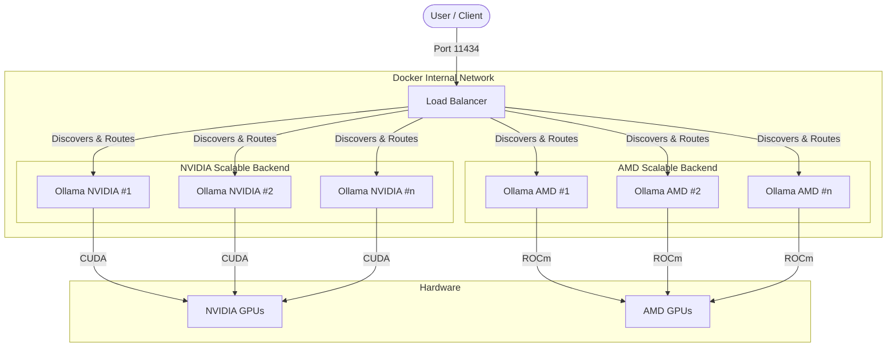

# ⚖️ Ollama Load Balancer

A high-performance, unified Load Balancer for Ollama that seamlessly routes requests between **NVIDIA** and **AMD** GPUs. Compatible with all standard Ollama clients.


## 🛠️ Architecture



The system consists of three main service types:
1.  **`load-balancer`**: The Rust proxy listening on 11434.
2.  **`ollama-nvidia`**: Scalable CUDA backend (Default: 1 replica).
3.  **`ollama-amd`**: Scalable ROCm backend (Default: 1 replica).

> **Note**: All backend instances share a single **Shared Storage Volume** (`ollama`) to ensure models are available across all replicas without duplication.

---

## 🚀 Features

*   **Unified Interface**: Exposes a standard Ollama API on port `11434`. Compatible with all standard Ollama clients (CLI, Web UIs, Libraries).
*   **Dual-Backend Support**:
    *   **NVIDIA**: Runs standard CUDA-accelerated Ollama.
    *   **AMD**: Runs ROCm-accelerated Ollama for Radeon/Instinct cards.
*   **Primary GPU Assignment**: Each container can have a different primary GPU while accessing all GPUs:
    *   Automatic GPU rotation for optimal load distribution
    *   Dynamic generation via `generate-compose.sh` script
    *   Full GPU pool access with customizable primary GPU per container
*   **Dynamic Scaling & Discovery**:
    *   Scale `nvidia` or `amd` backends to multiple replicas (e.g., 3 NVIDIA nodes).
    *   Load Balancer detects new instances automatically via Docker Socket.
    *   Traffic is distributed across all available replicas of the target type.
*   **Smart Aggregation**: Merges model lists (`/api/tags`) and running process lists (`/api/ps`) from both instances into a single view.
*   **Shared Storage**: Both instances use a single shared volume for models, ensuring consistency and preventing duplication.
*   **Auto-Detection of VRAM**: Automatically monitors **Real-Time Host VRAM** usage via `nsenter` (privileged access) for 100% accuracy, falling back to `nvidia-smi`/`rocm-smi` logs or static capacity if unavailable.
*   **Manual Selection**: Force specific requests to a specific backend using:
    *   **Prefix**: `amd/tinyllama`
    *   **Suffix**: `tinyllama@amd` (Strictly enforces vendor backend; will fail if vendor full rather than spill over)
*   **Load Balancing Strategies**:
    *   **Model Affinity** (Best for Performance): Routes to instance with model already loaded.
        *   **Dynamic Fallback**: If standard VRAM strategy fails (OOM), automatically attempts **Affinity Routing** to any backend that already has the model loaded, regardless of VRAM stats.
    *   **Least Connection**: Routes to least busy instance (used as secondary strategy).
    *   **VRAM**: Routes to instance with most free memory.
    *   **Round Robin**: Distributes requests evenly.
    *   **Preference**: Fixed routing to `nvidia` or `amd`.
    *   **Alternate**: Alternates between NVIDIA and AMD containers based on last used.

---

## 🏗️ Implementation

### 🦀 Rust
Located in `Rust_lb/`.
*   **Performance**: Native machine code, extremely low latency, tiny memory footprint (<10MB).
*   **Features**: 
    - Dynamic scaling with automatic Docker discovery
    - Real-time GPU monitoring and utilization tracking
    - Predictive VRAM filtering to prevent OOM errors
    - Multi-GPU per-container support
    - Advanced load balancing strategies (vram, round_robin, nvidia, amd, alternate)
    - Model affinity with intelligent fallback
    - Cross-vendor automatic fallback (NVIDIA → AMD when full)

> **Note**: A legacy Python implementation is available in `legacy/Python_lb/` for reference.

---

## ⚡ Quick Start

### 1. Configure Environment
Copy the example configuration:
```bash
cp .env.example .env
```

**Edit `.env` to set your desired configuration**:
```ini
# Load Balancer Implementation (Rust)
LB_BUILD_CONTEXT=./Rust_lb
LB_DOCKERFILE=Dockerfile

# Set number of containers (set to 0 to disable a vendor)
OLLAMA_NVIDIA_REPLICAS=2
OLLAMA_AMD_REPLICAS=2

# Load Balancing Strategy
LOAD_BALANCING_STRATEGY=vram

# Maximize availability with automatic OOM fallback
OLLAMA_MODEL_AFFINITY=true
ENFORCE_STRATEGY=false
```

### 2. Generate Configuration (Recommended)
Use the dynamic generator to create `docker-compose.yml` with GPU assignments:
```bash
./generate-compose.sh
```

This will:
- Generate individual container definitions based on your replica counts
- Auto-configure GPU assignments for optimal load distribution (assigns all physical GPUs to available replicas using modulo rotation)
- Update `.env` with GPU rotation settings
- **Note**: The load balancer requires `privileged: true` to perform real-time host GPU monitoring.

**OR** manually start with the pre-configured `docker-compose.yml`:
```bash
docker compose up -d --build
```

### 3. Verify
```bash
curl http://localhost:11434/api/version
```

---

## 📖 Usage

### Standard Commands
The Load Balancer makes your dual-GPU (or multi-node) setup look like a single Ollama instance.
```bash
# Run on default/vram-available backend
ollama run llama3
```

### Dynamic Scaling
Scale your backends on the fly. The Load Balancer discovers them instantly.
```bash
# Run 3 NVIDIA instances and 2 AMD instances
docker compose up -d --scale ollama-nvidia=3 --scale ollama-amd=2
```

### Single-Vendor Mode
If you only have one type of GPU (e.g., only NVIDIA), you can disable the other vendor by setting its replicas to `0` in `.env` (or via CLI).
```bash
# Run only NVIDIA instances (AMD disabled)
docker compose up -d --scale ollama-amd=0 --scale ollama-nvidia=1
```

### 🖥️  CLI Tool (olb)

The project includes a powerful Rust-based CLI Tool (`olb`) for enhanced management and interactive model discovery.

**Highlights**:
*   **Interactive Discovery**: Browse `ollama.com` models with a TUI.
*   **Smart Selection**: Jump to items by typing their number index (e.g., `1`), or fuzzy search by name.
*   **Detailed Metadata**: View context window sizes, input types, and more before downloading.

-> **[📖 Read the Full CLI Documentation](docs/CLI.md)**

**Quick Install**:
```bash
cd Rust_lb && cargo build --release && cp target/release/olb ~/.local/bin/olb
```

**Usage**:
```bash
# Search for models (interactive)
olb discover "llama3"

# Pull a model
olb pull "llama3"
```

### 🎯 Primary GPU Assignment

Configure each container to use a different primary GPU while maintaining access to all GPUs.

-> **[📖 Read the GPU Assignment Documentation](docs/GPU_Assignment.md)**

**Quick workflow**:
```bash
# 1. Set replica counts in .env
vim .env  # OLLAMA_NVIDIA_REPLICAS=3, OLLAMA_AMD_REPLICAS=2

# 2. Generate configuration
./generate-compose.sh

# 3. Start services
docker compose up -d
```

### Seamless Integration (Recommended)
To use `discover` seamlessly as `ollama discover`, add this wrapper to your shell configuration (`~/.bashrc` or `~/.zshrc`).
**Note**: This assumes `olb` is in your `$PATH` (e.g., installed to `~/.local/bin`).

```bash
echo '
ollama() {
    if [ "$1" = "discover" ]; then
        olb discover "${@:2}"
    else
        command ollama "$@"
    fi
}' >> ~/.bashrc
source ~/.bashrc
```

**Verify the setup**:
```bash
ollama discover llama3
```

### Manual Instance Selection
Force execution on a specific GPU vendor:

**Method 1: Prefixes (Clean, recommended for CLI)**
```bash
ollama run amd/tinyllama
ollama run nvidia/llama3
```

**Method 2: Suffixes**
```bash
ollama run tinyllama@amd
ollama run llama3@nvidia
```

**Method 3: Specific Replica Targeting** (Subset Routing)
Target specific backend instances by index (0-based).
```bash
# Target the 1st AMD instance (Index 0)
ollama run tinyllama@amd:0

# Target the 2nd NVIDIA instance (Index 1)
ollama run llama3@nvidia:1

# Load balance ONLY between specific instances (e.g., 0 and 2)
ollama run llama3@amd:0,2
```

### Advanced Routing & Prioritization
Control strategy via `.env` or Headers.

**Strategies available in `.env`**:
*   `vram` (Default): Use backend with most free memory.
*   `round_robin`: Random distribution.
*   `nvidia` / `amd`: Strict preference.

**Request Overrides (Headers)**:
```bash
curl http://localhost:11434/api/generate \
  -d '{"model": "llama3.1", "prompt": "Why is the sky blue?"}' \
  -H "X-Load-Balancing-Strategy: amd" \
  -H "X-Enforce-Strategy: true"
```

---

## ⚙️ Configuration

Centralized in `.env`.

### Core Settings

| Variable | Description | Default |
|----------|-------------|---------|
| `PORT` | Load Balancer external port | `11434` |
| `LB_BUILD_CONTEXT` | Path to source code | `./Rust_lb` |
| `LOAD_BALANCING_STRATEGY`| Routing logic (`vram`, `round_robin`, `nvidia`, `amd`, `alternate`) | `vram` |
| `OLLAMA_ENABLE_AFFINITY` | Enable Sticky Routing & Least Connection (`true`/`false`) | `false` |
| `OLLAMA_NVIDIA_REPLICAS`| Number of NVIDIA containers to generate | `1` |
| `OLLAMA_AMD_REPLICAS`| Number of AMD containers to generate | `1` |
| `OLLAMA_NVIDIA_VRAM_MB` | Total VRAM per NVIDIA instance (MB). Leave empty to Autodetect. | *Autodetect* |
| `OLLAMA_AMD_VRAM_MB` | Total VRAM per AMD instance (MB). Leave empty to Autodetect. | *Autodetect* |
| `LOG_LEVEL` | Log verbosity (`info`, `debug`, `trace`, `warn`, `error`) | `info` |

### GPU Assignment (Auto-Generated by `generate-compose.sh`)

| Variable | Description | Example |
|----------|-------------|----------|
| `NVIDIA_GPU_1`, `NVIDIA_GPU_2`, ... | GPU order for each NVIDIA container (comma-separated) | `0,1,2` |
| `AMD_GPU_1`, `AMD_GPU_2`, ... | GPU order for each AMD container (comma-separated) | `1,0` |

**Note**: GPU assignment variables are automatically generated when running `./generate-compose.sh`. The first GPU in each list becomes the primary GPU (GPU 0 from the container's perspective).

### Dynamic Configuration Script

Use `./generate-compose.sh` to automatically:
1. Read `OLLAMA_NVIDIA_REPLICAS` and `OLLAMA_AMD_REPLICAS` from `.env`
2. Generate GPU assignment variables (Assigns all `TOTAL_NVIDIA/AMD_GPUS` to replicas using modulo rotation)
3. Create `docker-compose.yml` with individual container definitions

**Example workflow**:
```bash
# 1. Edit .env
vim .env  # Set OLLAMA_NVIDIA_REPLICAS=3, OLLAMA_AMD_REPLICAS=2

# 2. Generate configuration
./generate-compose.sh

# 3. Start services
docker compose up -d
```

---

## 🔧 Troubleshooting

*   **"Error: something went wrong" (CLI)**:
    *   Check `docker compose logs load-balancer`.
    *   Ensure you are using the latest version of this project which fixes the CLI payload handling bug.
*   **Streaming timeouts**:
    *   Verify your request client allows keeping connections open. The LB handles backpressure correctly.
*   **AMD GPU not detected**:
    *   Check the host's ROCm version.
    *   Ensure `ROCR_VISIBLE_DEVICES` in `.env` matches your hardware ID.

---

## 📝 Roadmap / TODO

*   **Debug `/api/ps` for AMD**: Investigate why `ollama ps` does not show models currently served on AMD backend instances.

---

## 🤝 Contributing
Contributions are welcome!

## 🤝 Author

**[TheophileH](https://github.com/TheophileH)**

## 📄 License
MIT License.
